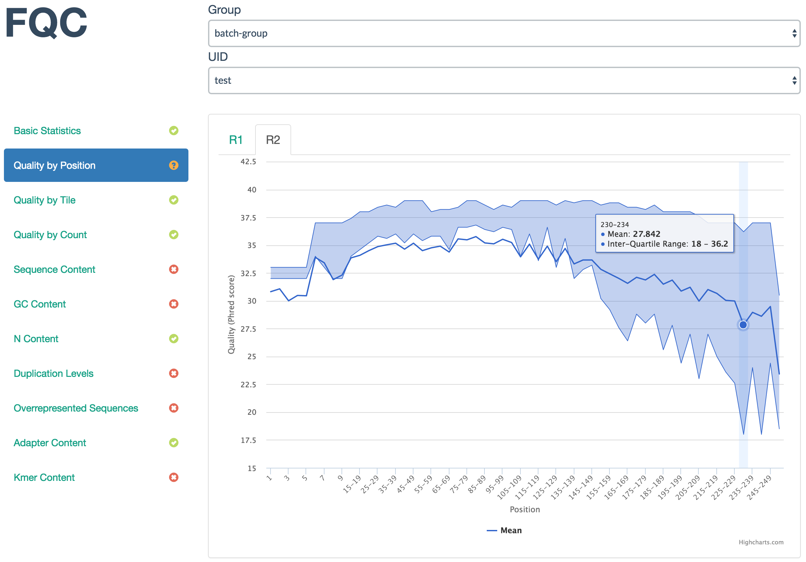

# FASTQ QA/QC Dashboard



FQC is designed to better group FastQC result data across groups where each
group is comprised of FASTQs related to an experiment or sequencing batch.
Individual samples are grouped into paired-end sets when available and the
dashboard's extensibility allows a user to add plots or tables as desired.


# Complete Documentation

To see the full documentation and get started, see:

https://pnnl-fqc.readthedocs.io/


# Requires

Parsing the table and running `FastQC` is performed with code written for
Python 3. We recommend using [Anaconda](https://www.continuum.io/downloads) to
install the FastQC dependency:

```
conda install -c bioconda fastqc
```


# Install

The dashboard reads local files, so install where you will eventually be
serving the site.

```
git clone https://github.com/pnnl/fqc.git
cd fqc
python setup.py install
```

This installs `fqc` command-line tool to process FASTQs and create the
dashboard.

Then to deploy a local copy from within the `fqc` directory, you can run:

```
python -m http.server --bind localhost 8000
```

And navigate to `localhost:8000` in your browser.

By default, this will show the test data QC as determined by the data
directory in `js/fqc.js`:

```
var filePath = "/example/plot_data/"
```

Edit `fqc.js` to your local path **within** the `fqc` directory tree.


# Processing a FASTQ

The first time this is run, it will build the entire backend of the site.
Additional FASTQs being written to the same output directory are added to
the backend according to Group ID and UID.


## Single-end FASTQ

```
$ fqc qc group sample sample_r1.fastq.gz
[2016-07-26 13:24 INFO] Writing data to: plot_data/group/sample
[2016-07-26 13:24 INFO] Running FastQC
[2016-07-26 13:27 INFO] Extracting data from FastQC archives
[2016-07-26 13:27 INFO] Processing of sample1 complete
```


## Paired-end FASTQs

```
fqc qc --r2 sample_r2.fastq.gz 2016 sample sample_r1.fastq.gz
```
