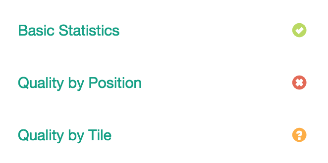

.. _config:

Configuration File
==================

Each FASTQ or FASTQ pair will have an associated config.json file that holds
information like which plots to draw into which tabs and where the associated
data files reside. Each entry must have a ``tab_name``, ```filename``, and
``chart_properties`` specific to the chart type. For more information on
individual plots and their requirements, see their respective pages.


.. _tab-status:

Tab Status
``````````

This is an optional icon for page tabs and supports values of ``pass``,
``fail``, or ``warn``. It's rendered as:




Plot Options
````````````

The configuration of plots themselves occurs within the ``chart_properties``
key. Individual plot options are defined in the docs under each plot type.


Manual Editing
``````````````

Plots can edited and plot data can be added manually to a particular sample's
``config.json``. If you're adding a new sample manually, you will have to add
it to ``groups.json``.
