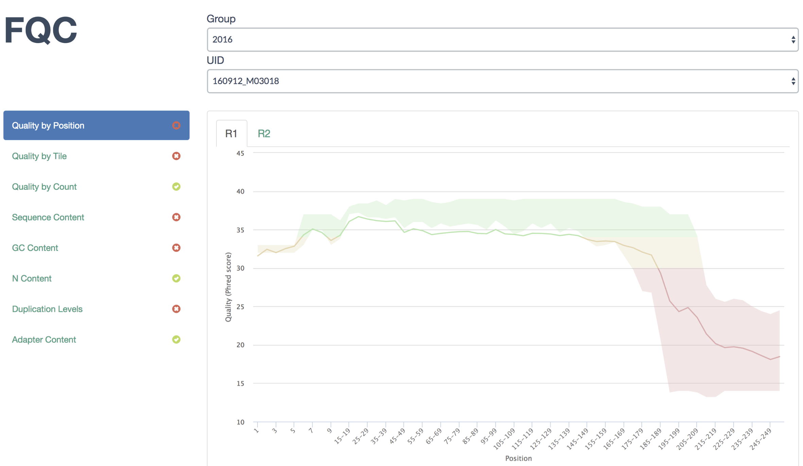
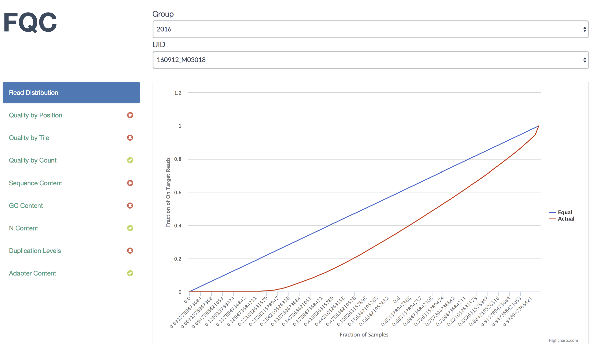
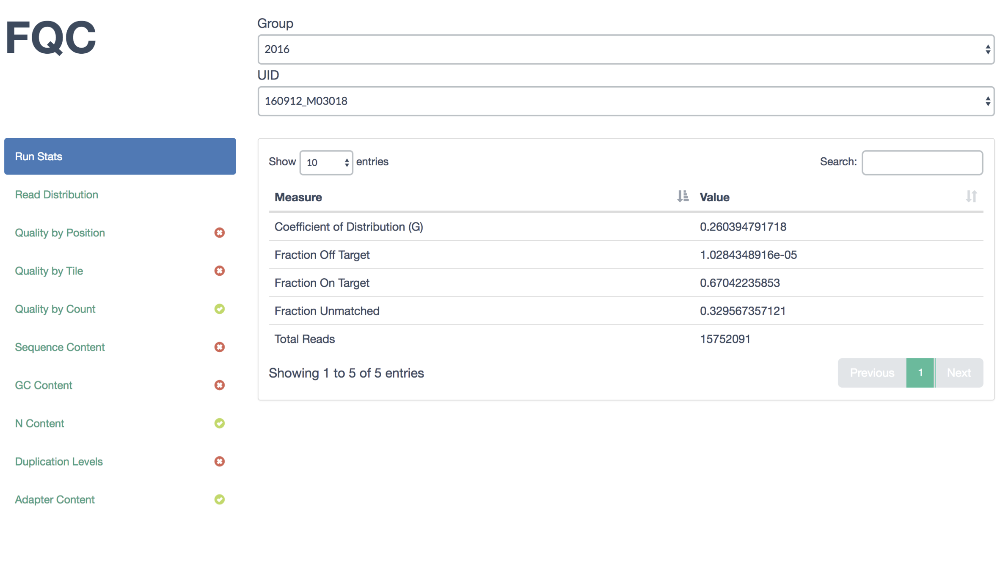
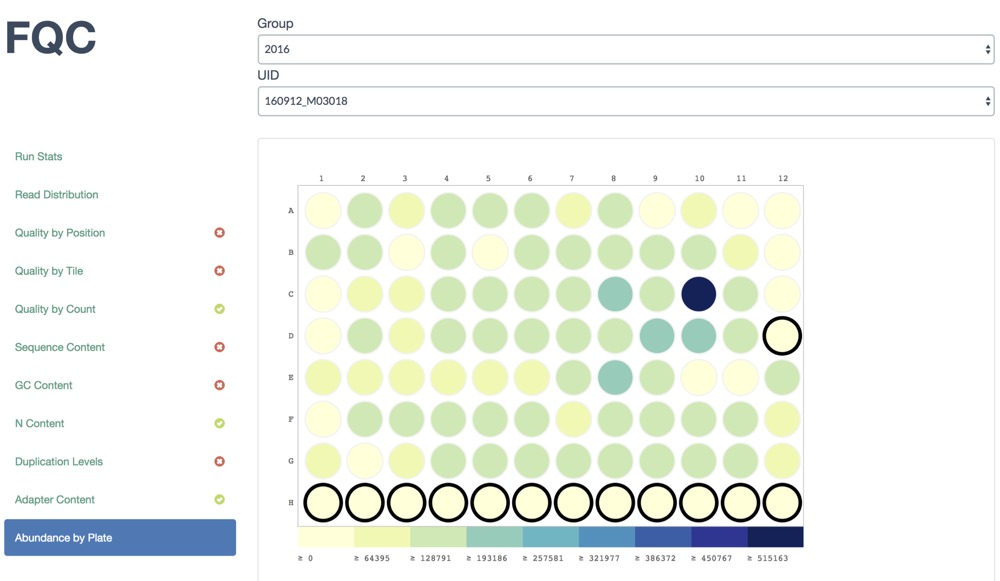
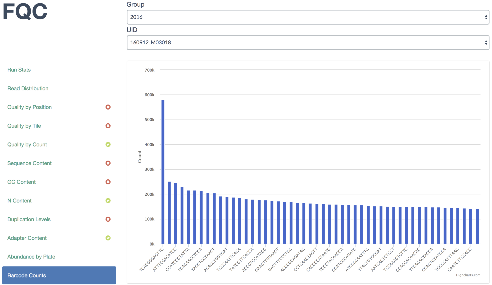

Example Workflow
================

Using the example data set provided in the repo, let's walk through creating
the example site with paired-end data and some custom plots.

In our example, we're looking at highly replicated 16S amplicon data, so we
will be omitting non-informative plots from our display using ``--exclude``.

Running QC
``````````

After installation, run QC over the first sample and generate the dashboard
from within fqc repository::

    $ cd example
    $ fqc qc -t 8 -e 'Basic Statistics' \
          -e 'Overrepresented Sequences' \
          -e 'Count by Length' \
          -e 'Kmer Content' \
          2016 160912_M03018 data/fastqs/160912_M03018_R1.fastq.gz




Adding Custom Plots
```````````````````

Next, add the Lorenz curve which gives us an idea of how equitably the
sequences were distributed among barcodes. This plot will be added as the
top tab using ``--prepend``::

    $ fqc add --prepend --x-value FractionOfSamples --y-value Equal \
          --y-value Actual --x-label 'Fraction of Samples' \
          --y-label 'Fraction of On Target Reads' \
          plot_data/2016/160912_M03018/config.json \
          'Read Distribution' \
          line \
          data/tables/160912_lorenz.csv

The JSON entry in the output above is just for confirmation as it has already
been added to this run's configuration.

Our display now shows the new tab in the first position:



.. tip::
    Based on the distribution of barcodes, the user could have specified a
    fail or warning condition on using the Gini Coefficient and set a tab icon
    using ``--status fail`` in the previous command. For more information
    see :ref:`tab-status`.

To add the sequence summary table, we need to append another tab::

    $ fqc add --prepend \
          plot_data/2016/160912_M03018/config.json \
          'Run Stats' \
          table \
          data/tables/160912_summary.csv




.. _plate-heatmap-example:

Another plot we typically add shows read abundance across primer plates.
This is valuable to observe positive and negative control wells in
addition to seeing the effects on neighboring wells. Run 160912 did not
have any controls, so we'll just add abundance for its plate::

    $ fqc add --x-value WELL_COL --y-value WELL_ROW \
          --value TOTAL_PAIRED_READS --label LABEL \
          --label-color LABEL_COLOR \
          plot_data/2016/160912_M03018/config.json \
          'Abundance by Plate' \
          plateheatmap \
          data/tables/160912_plate_1.csv



And finally, sometimes things go wrong and barcode plates get mixed up, so we
display the top barcodes and their counts. Usually we simply add it as a table,
but lets display it as a bar plot::

    $ fqc add --x-value Barcode --y-value Count \
          plot_data/2016/160912_M03018/config.json \
          "Barcode Counts" \
          bar \
          data/tables/160912_top50barcodes.csv




The remainder of the example site iterates over these steps for the remainder
of the samples.
