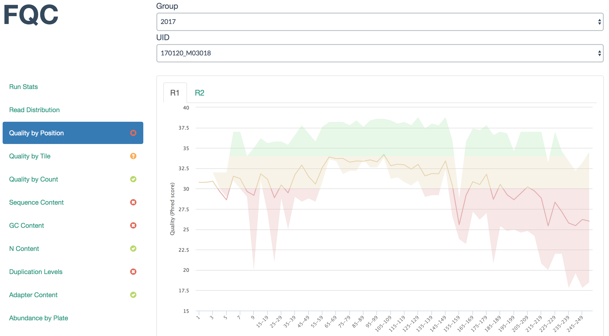

.. FQC documentation master file, created by

FQC: FASTQ QA/QC Dashboard
==========================

FQC is designed to better group FastQC result data across groups where each
group is comprised of FASTQs related to an experiment or sequencing batch.
Individual samples are grouped into paired-end sets when available and the
dashboard's extensibility allows a user to add plots or tables as desired.

.. toctree::
    :maxdepth: 2
    :caption: Getting Started

    install
    example_workflow

.. toctree::
    :maxdepth: 2
    :caption: Customization

    groups
    config
    plot_tabs
    plots/area_range
    plots/bar
    plots/heatmap
    plots/histogram
    plots/line
    plots/plateheatmap
    plots/table
