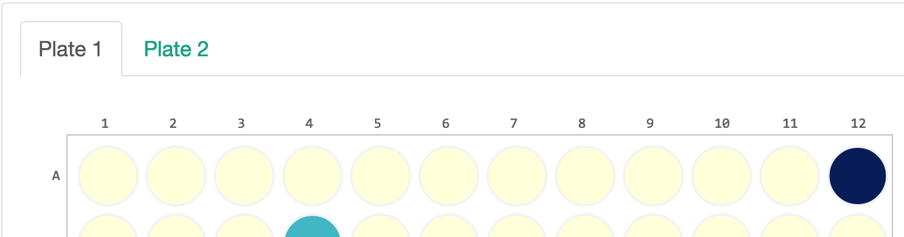

.. _plot-tabs:

Plot Tabs
=========

Tabs can be added to the plot area using a list of lists for the ``filename``
attribute. The first position is the name of the tab while the second is the
file path. An example JSON entry for this in a sample's ``config.json`` looks
like::

    "filename": [
            [
                "Plate 1",
                "plt1_counts.csv"
            ],
            [
                "Plate 2",
                "plt2_counts.csv"
            ]
    ]

Which will render as:

