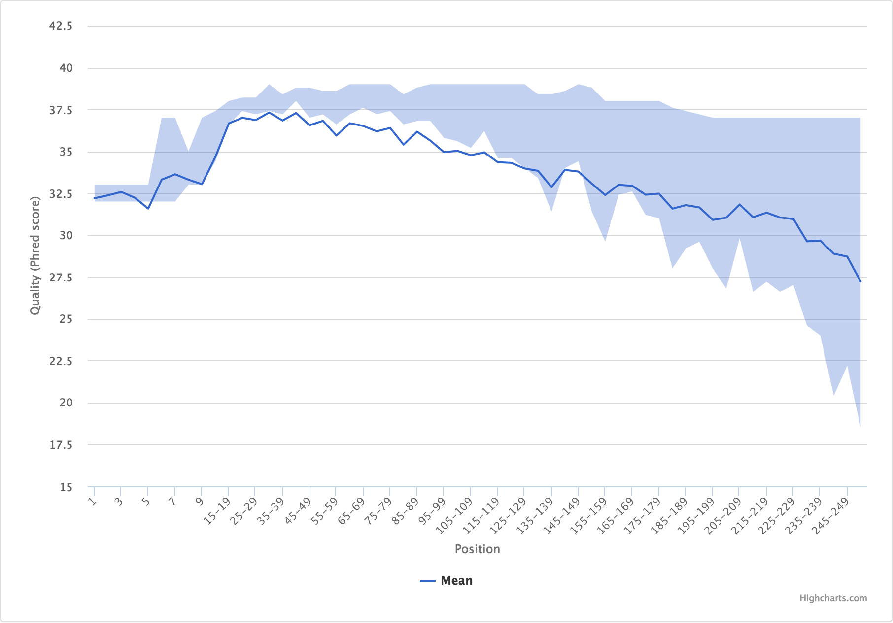

Area Range
==========

The area range plot is automatically generated from FastQC output for
inspecting read quality as a function of position along the sequence.


Example Data
````````````

An example table after parsing output from FastQC looks like:

+------+--------+----------------+----------------+
| Base | Mean   | Lower Quartile | Upper Quartile |
+======+========+================+================+
| 1    | 32.193 | 32.0           | 33.0           |
+------+--------+----------------+----------------+
| 2    | 32.365 | 32.0           | 33.0           |
+------+--------+----------------+----------------+
| 3    | 32.570 | 32.0           | 33.0           |
+------+--------+----------------+----------------+


Plot Options
````````````

+------------------+------------------------------------------------------------------------------------------------------------------+
| Option           | Value                                                                                                            |
+==================+==================================================================================================================+
| filename         | supports either a single file path or list of lists with [plot tab name, file path] pairs (see :ref:`plot-tabs`) |
+------------------+------------------------------------------------------------------------------------------------------------------+
| tab_name         | left main menu entry                                                                                             |
+------------------+------------------------------------------------------------------------------------------------------------------+
| status           | left main menu icon -- supports 'pass', 'fail', 'warn', or alternatively, omitted (see :ref:`tab-status`)        |
+------------------+------------------------------------------------------------------------------------------------------------------+
| chart_properties | See table below                                                                                                  |
+------------------+------------------------------------------------------------------------------------------------------------------+


Chart Properties
````````````````

+----------------+-----------------------------------------------------------------------------------+
| Option         | Value                                                                             |
+================+===================================================================================+
| type           | the required entry is 'arearange'                                                 |
+----------------+-----------------------------------------------------------------------------------+
| x_label        | x-axis label                                                                      |
+----------------+-----------------------------------------------------------------------------------+
| x_value        | the header label defined in filename corresponding to x-values                    |
+----------------+-----------------------------------------------------------------------------------+
| y_label        | y-axis label                                                                      |
+----------------+-----------------------------------------------------------------------------------+
| lower_quartile | the header label defined in filename corresponding to lower quartile values       |
+----------------+-----------------------------------------------------------------------------------+
| upper_quartile | the header label defined in filename corresponding to upper quartile values       |
+----------------+-----------------------------------------------------------------------------------+
| mean           | the header label defined in filename corresponding to mean values                 |
+----------------+-----------------------------------------------------------------------------------+
| zones          | defined as 'value':'color' with an initial 'color' as the base; see example below |
+----------------+-----------------------------------------------------------------------------------+

Example JSON entry::

    {
        "filename": "R1/Per_base_sequence_quality.csv",
        "tab_name": "Quality by Position",
        "status": "pass",
        "chart_properties": {
            "type": "arearange",
            "x_label": "Position",
            "x_value": "Base",
            "y_label": "Quality (Phred score)",
            "lower_quartile": "Lower Quartile",
            "upper_quartile": "Upper Quartile",
            "mean": "Mean"
        }
    }



There is support for adding zones as well, if you're going for the classic
FastQC look and feel::

    {
        "filename": [
            ["R1", "R1/Per_base_sequence_quality.csv"],
            ["R2", "R2/Per_base_sequence_quality.csv"]
        ],
        "tab_name": "Quality by Position",
        "status": "warn",
        "chart_properties": {
            "type": "arearange",
            "x_label": "Position",
            "x_value": "Base",
            "y_label": "Quality (Phred score)",
            "lower_quartile": "Lower Quartile",
            "upper_quartile": "Upper Quartile",
            "mean": "Mean",
            "zones": [
                {"value": 30, "color": "#e5afb0"},
                {"value": 34, "color": "#e6d6b1"},
                {"color": "#b0e5b1"}
            ]
        }
    }

.. image:: ../_static/arearange_zones.png
