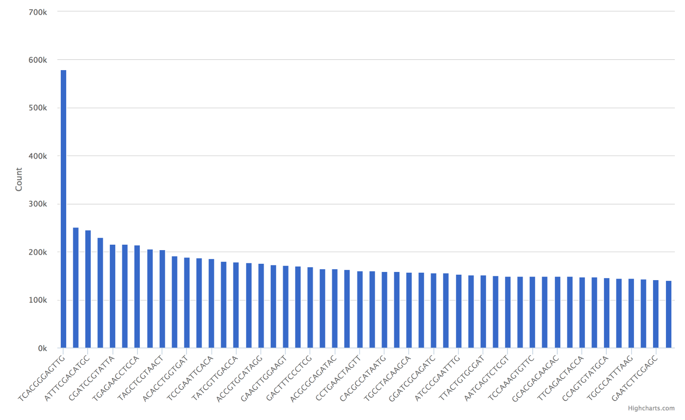

Bar
===

No bar plots are automatically generated from FastQC output, but can optionally
be added for custom data tables.

Example Data
````````````

.. csv-table::
    :file: ../_static/bar_plot_example.csv
    :header-rows: 1


Usage to Add
````````````

Given the example data for barcode counts::

    $ fqc add --x-value Barcode --y-value Count \
          plot_data/2016/160912_M03018/config.json \
          "Barcode Counts" \
          bar \
          example/data/tables/160912_top50barcodes.csv


Plot Options
````````````

+------------------+------------------------------------------------------------------------------------------------------------------+
| Option           | Value                                                                                                            |
+==================+==================================================================================================================+
| filename         | supports either a single file path or list of lists with [plot tab name, file path] pairs (see :ref:`plot-tabs`) |
+------------------+------------------------------------------------------------------------------------------------------------------+
| tab_name         | left main menu entry                                                                                             |
+------------------+------------------------------------------------------------------------------------------------------------------+
| status           | left main menu icon -- supports 'pass', 'fail', 'warn', or alternatively, omitted (see :ref:`tab-status`)        |
+------------------+------------------------------------------------------------------------------------------------------------------+
| chart_properties | See table below                                                                                                  |
+------------------+------------------------------------------------------------------------------------------------------------------+


Chart Properties
````````````````

+----------------+-----------------------------------------------------------------------------------+
| Option         | Value                                                                             |
+================+===================================================================================+
| type           | the required entry is 'bar'                                                       |
+----------------+-----------------------------------------------------------------------------------+
| subtitle       | an optional subtitle for the plot                                                 |
+----------------+-----------------------------------------------------------------------------------+
| x_label        | x-axis label                                                                      |
+----------------+-----------------------------------------------------------------------------------+
| x_value        | the header label defined in filename corresponding to x-values                    |
+----------------+-----------------------------------------------------------------------------------+
| y_label        | y-axis label                                                                      |
+----------------+-----------------------------------------------------------------------------------+
| y_value        | the header label defined in filename corresponding to y-values                    |
+----------------+-----------------------------------------------------------------------------------+

Example JSON entry::

    {
        "filename": "bar_plot_example.csv",
        "tab_name": "Barcode Counts",
        "chart_properties": {
            "type": "bar",
            "x_value": "Barcode",
            "x_label": "Barcode",
            "y_value": [ "Count" ],
            "y_label": "Count"
    }



