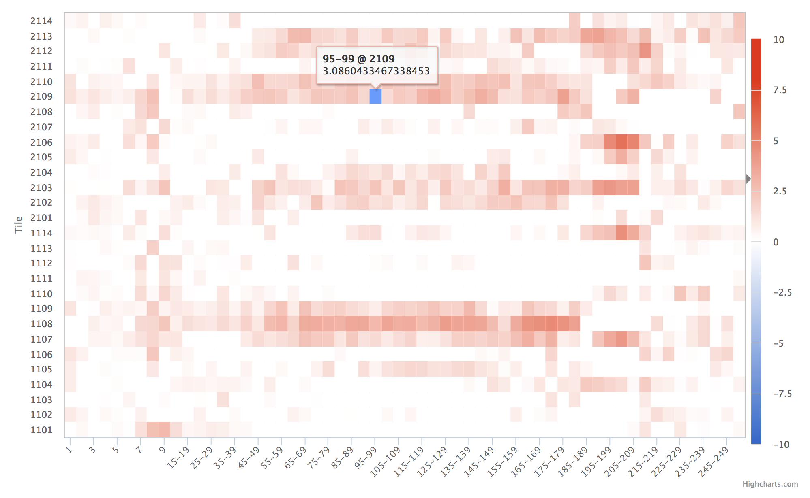

Heatmap
=======

A heatmap is generated using tile quality data from FastQC, but a custom
one can be generated using data with an ``x``, a ``y``, and value associated
with the coordinate.

Example Data
````````````

+------+------+--------+
| Tile | Base | Mean   |
+======+======+========+
| 1101 | 1    | 0.4305 |
+------+------+--------+
| 1101 | 2    | 0.1525 |
+------+------+--------+
| 1101 | 3    | 0.0202 |
+------+------+--------+

Usage to Add
````````````

Tile example data from FastQC can be added manually using::

    $ fqc add --x-value Barcode --y-value Count --min-value -10 --max-value 10 \
          plot_data/2016/160912_M03018/config.json \
          "Barcode Counts" \
          bar \
          example/data/tables/160912_top50barcodes.csv


Plot Options
````````````

+------------------+------------------------------------------------------------------------------------------------------------------+
| Option           | Value                                                                                                            |
+==================+==================================================================================================================+
| filename         | supports either a single file path or list of lists with [plot tab name, file path] pairs (see :ref:`plot-tabs`) |
+------------------+------------------------------------------------------------------------------------------------------------------+
| tab_name         | left main menu entry                                                                                             |
+------------------+------------------------------------------------------------------------------------------------------------------+
| status           | left main menu icon -- supports 'pass', 'fail', 'warn', or alternatively, omitted (see :ref:`tab-status`)        |
+------------------+------------------------------------------------------------------------------------------------------------------+
| chart_properties | See table below                                                                                                  |
+------------------+------------------------------------------------------------------------------------------------------------------+


Chart Properties
````````````````

+----------------+-----------------------------------------------------------------------------------+
| Option         | Value                                                                             |
+================+===================================================================================+
| type           | the required entry is 'heatmap'                                                   |
+----------------+-----------------------------------------------------------------------------------+
| subtitle       | an optional subtitle for the plot                                                 |
+----------------+-----------------------------------------------------------------------------------+
| x_label        | x-axis label                                                                      |
+----------------+-----------------------------------------------------------------------------------+
| x_value        | the header label defined in filename corresponding to x-values                    |
+----------------+-----------------------------------------------------------------------------------+
| y_label        | y-axis label                                                                      |
+----------------+-----------------------------------------------------------------------------------+
| y_value        | the header label defined in filename corresponding to y-values                    |
+----------------+-----------------------------------------------------------------------------------+
| value          | the header label defined in filename corresponding to heatmap values              |
+----------------+-----------------------------------------------------------------------------------+
| min_color      | the minimum color used in the heatmap color map                                   |
+----------------+-----------------------------------------------------------------------------------+
| mid_color      | the middle color used in the heatmap color map                                    |
+----------------+-----------------------------------------------------------------------------------+
| max_color      | the maximum color used in the heatmap color map                                   |
+----------------+-----------------------------------------------------------------------------------+
| min            | the minimum value defined for the heatmap color map                               |
+----------------+-----------------------------------------------------------------------------------+
| max            | the maximum value defined for the heatmap color map                               |
+----------------+-----------------------------------------------------------------------------------+


Example JSON entry::

    {
        "filename": "R1/Per_tile_sequence_quality.csv",
        "tab_name": "Quality by Tile",
        "status": "pass",
        "chart_properties": {
            "type": "heatmap",
            "subtitle": "Per Tile Average Quality Deviation",
            "x_label": "Position",
            "x_value": "Base",
            "y_label": "Tile",
            "y_value": "Tile",
            "shape": "square",
            "value": "Mean",
            "min": "-10",
            "max": "10",
            "min_color": "#36c",
            "mid_color": "#ffffff",
            "max_color": "#dc3912"
        }
    }


