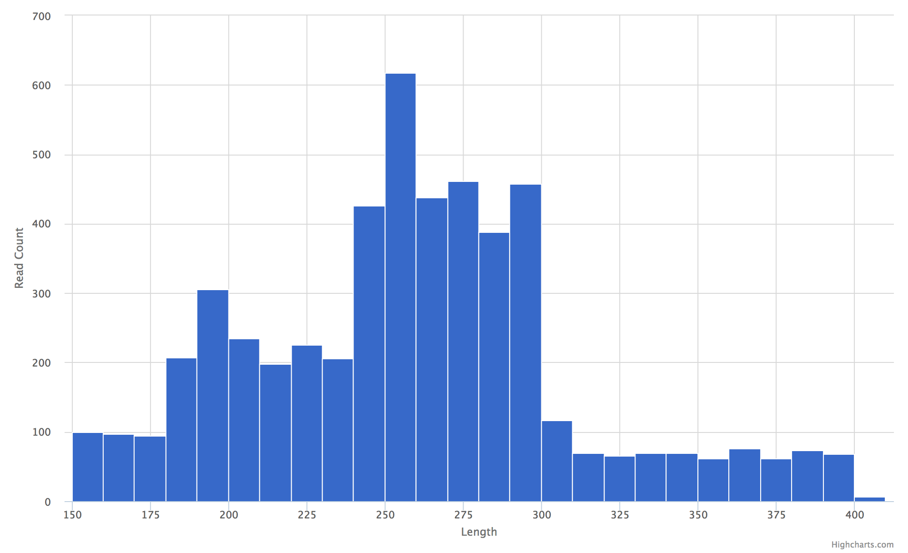

Histogram
=========

This plot is useful in the context of 16S amplicon sequencing after we've
quality trimmed reads then joined paired-end reads. Tabulating observed
read lengths and their respective counts can give insights into the quality
of the sequence ends.


Example Data
````````````

.. csv-table::
    :file: ../_static/histogram_example_head.csv
    :header-rows: 1


Usage to Add
````````````

Given the example data for read length counts::

    $ fqc add -x Length -Y "Read Count" --step 10 \
          plot_data/2016/160912_M03018/config.json \
          "Joined Read Lengths" \
          histogram \
          data/tables/histogram_example.csv


Plot Options
````````````

+------------------+------------------------------------------------------------------------------------------------------------------+
| Option           | Value                                                                                                            |
+==================+==================================================================================================================+
| filename         | supports either a single file path or list of lists with [plot tab name, file path] pairs (see :ref:`plot-tabs`) |
+------------------+------------------------------------------------------------------------------------------------------------------+
| tab_name         | left main menu entry                                                                                             |
+------------------+------------------------------------------------------------------------------------------------------------------+
| status           | left main menu icon -- supports 'pass', 'fail', 'warn', or alternatively, omitted (see :ref:`tab-status`)        |
+------------------+------------------------------------------------------------------------------------------------------------------+
| chart_properties | See table below                                                                                                  |
+------------------+------------------------------------------------------------------------------------------------------------------+


Chart Properties
````````````````

+----------------+-----------------------------------------------------------------------------------+
| Option         | Value                                                                             |
+================+===================================================================================+
| type           | the required entry is 'histogram'                                                 |
+----------------+-----------------------------------------------------------------------------------+
| subtitle       | an optional subtitle for the plot                                                 |
+----------------+-----------------------------------------------------------------------------------+
| x_label        | x-axis label                                                                      |
+----------------+-----------------------------------------------------------------------------------+
| x_value        | the header label defined in filename corresponding to values                      |
+----------------+-----------------------------------------------------------------------------------+
| y_label        | y-axis label                                                                      |
+----------------+-----------------------------------------------------------------------------------+
| step           | histogram bin size                                                                |
+----------------+-----------------------------------------------------------------------------------+

Example JSON entry::

    {
        "filename": "histogram_example.csv",
        "tab_name": "Joined Read Lengths",
        "chart_properties": {
            "type": "histogram",
            "x_value": "Length",
            "x_label": "Length",
            "y_label": "Read Count",
            "step": 10
        }
    }


