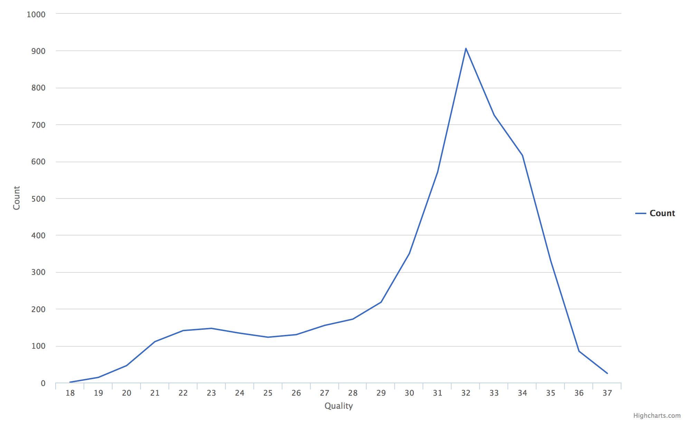
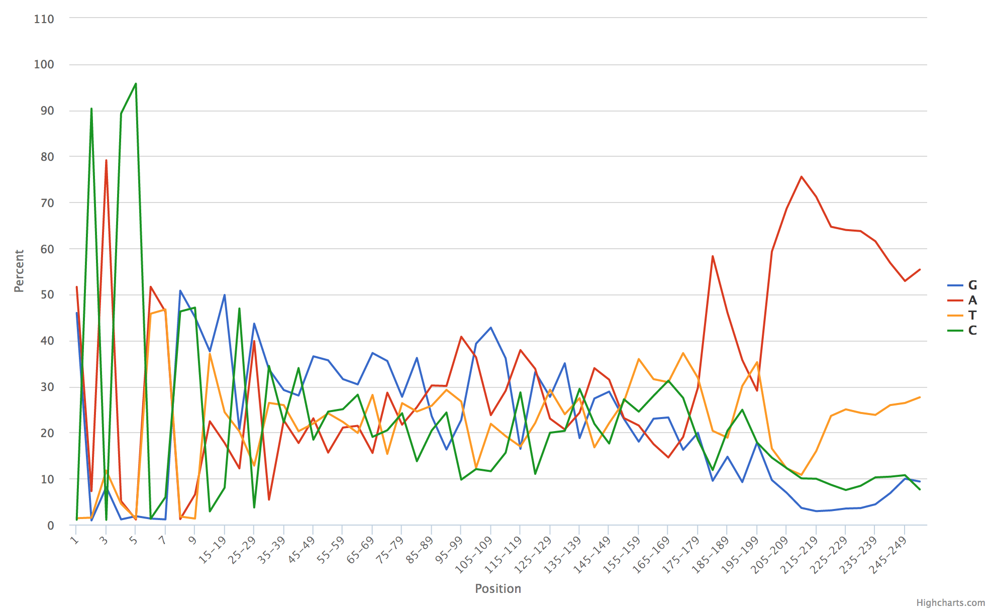

Line
====

Example Data
````````````

.. csv-table::
    :file: ../_static/simple_line_head.csv
    :header-rows: 1


Usage to Add
````````````

Given quality data across read positions, we can add this plot using::

    $ fqc add --x-value Barcode --y-value Count \
          plot_data/2016/160912_M03018/config.json \
          "Barcode Counts" \
          bar \
          example/data/tables/160912_top50barcodes.csv


Plot Options
````````````

+------------------+------------------------------------------------------------------------------------------------------------------+
| Option           | Value                                                                                                            |
+==================+==================================================================================================================+
| filename         | supports either a single file path or list of lists with [plot tab name, file path] pairs (see :ref:`plot-tabs`) |
+------------------+------------------------------------------------------------------------------------------------------------------+
| tab_name         | left main menu entry                                                                                             |
+------------------+------------------------------------------------------------------------------------------------------------------+
| status           | left main menu icon -- supports 'pass', 'fail', 'warn', or alternatively, omitted (see :ref:`tab-status`)        |
+------------------+------------------------------------------------------------------------------------------------------------------+
| chart_properties | See table below                                                                                                  |
+------------------+------------------------------------------------------------------------------------------------------------------+


Chart Properties
````````````````

+----------------+-----------------------------------------------------------------------------------+
| Option         | Value                                                                             |
+================+===================================================================================+
| type           | the required entry is 'bar'                                                       |
+----------------+-----------------------------------------------------------------------------------+
| subtitle       | an optional subtitle for the plot                                                 |
+----------------+-----------------------------------------------------------------------------------+
| x_label        | x-axis label                                                                      |
+----------------+-----------------------------------------------------------------------------------+
| x_value        | the header label defined in filename corresponding to x-values                    |
+----------------+-----------------------------------------------------------------------------------+
| y_label        | y-axis label                                                                      |
+----------------+-----------------------------------------------------------------------------------+
| y_value        | the header label defined in filename corresponding to y-values                    |
+----------------+-----------------------------------------------------------------------------------+


Example JSON entry::

    {
        "filename": "simple_line.csv",
        "tab_name": "Quality by Position",
        "chart_properties": {
            "type": "line",
            "x_value": "Quality",
            "x_label": "Quality",
            "y_value": ["Count"],
            "y_label": "Count"
        }
    }





Multi-line Plots
````````````````

When multiple y-values are being plotted:

.. csv-table::
    :file: ../_static/multiple_line_head.csv
    :header-rows: 1

These data are added by specifying ``-y`` multiple times::

    $ fqc add -x Base -X Position \
          -y G -y A -y C -y T \
          -Y Percent \
          plot_data/2016/160912_M03018/config.json \
          "Content by Position" \
          line \
          data/tables/multiple_line.csv

Example JSON entry::

    {
        "filename": "multiple_line.csv",
        "tab_name": "Content by Position",
        "chart_properties": {
            "type": "line",
            "x_label": "Position",
            "x_value": "Base",
            "y_label": "Percent",
            "y_value": [
                "G",
                "A",
                "C",
                "T"
            ]
        }
    }



