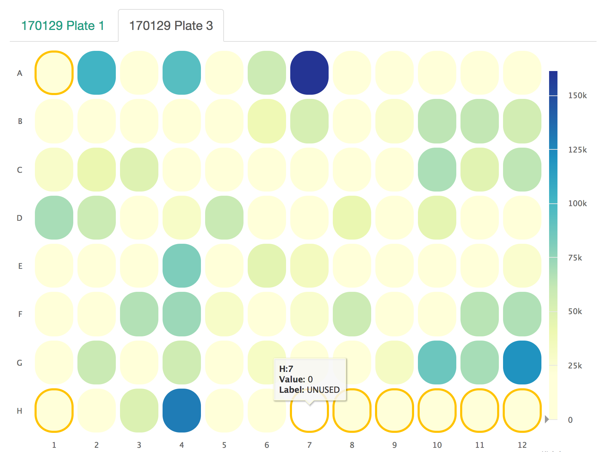

Plate Heatmap
=============

This plot is intended to be a nicely spaced heatmap specifically for showing
trends over sample plates. Definitions for colors are optional and will be
used to outline their respective coordinates.

An example for this plot type is executed in the workflow at :ref:`plate-heatmap-example`.

Example Data
````````````

This is an alternate example from the workflow to show how to deal with
multiple label colors.

+----------+----------+--------------------+----------+
| WELL_COL | WELL_ROW | TOTAL_PAIRED_READS | LABEL    |
+==========+==========+====================+==========+
| 1        | A        | 205                |          |
+----------+----------+--------------------+----------+
| 2        | A        | 103                | POS CTRL |
+----------+----------+--------------------+----------+
| 3        | A        | 125                | NEG CTRL |
+----------+----------+--------------------+----------+


Usage to Add
````````````

::

    $ fqc add --x-value WELL_COL --y-value WELL_ROW \
          --value TOTAL_PAIRED_READS --label LABEL \
          --colors 'NEG CTRL:#1f77b4,POS CTRL:#d62728' \
          plot_data/2016/160912_M03018/config.json \
          'Abundance by Plate' \
          plateheatmap \
          data/tables/160912_plate_1.csv


Plot Options
````````````

+------------------+------------------------------------------------------------------------------------------------------------------+
| Option           | Value                                                                                                            |
+==================+==================================================================================================================+
| filename         | supports either a single file path or list of lists with [plot tab name, file path] pairs (see :ref:`plot-tabs`) |
+------------------+------------------------------------------------------------------------------------------------------------------+
| tab_name         | left main menu entry                                                                                             |
+------------------+------------------------------------------------------------------------------------------------------------------+
| status           | left main menu icon -- supports 'pass', 'fail', 'warn', or alternatively, omitted (see :ref:`tab-status`)        |
+------------------+------------------------------------------------------------------------------------------------------------------+
| chart_properties | See table below                                                                                                  |
+------------------+------------------------------------------------------------------------------------------------------------------+


Chart Properties
````````````````

+----------------+----------------------------------------------------------------------------------------------------------+
| Option         | Value                                                                                                    |
+================+==========================================================================================================+
| type           | the required entry is 'plateheatmap'                                                                     |
+----------------+----------------------------------------------------------------------------------------------------------+
| subtitle       | an optional subtitle for the plot                                                                        |
+----------------+----------------------------------------------------------------------------------------------------------+
| x_label        | x-axis label                                                                                             |
+----------------+----------------------------------------------------------------------------------------------------------+
| x_value        | the header label defined in filename corresponding to x-values                                           |
+----------------+----------------------------------------------------------------------------------------------------------+
| y_label        | y-axis label                                                                                             |
+----------------+----------------------------------------------------------------------------------------------------------+
| y_value        | the header label defined in filename corresponding to y-values                                           |
+----------------+----------------------------------------------------------------------------------------------------------+
| colors         | comma separated list of label (in your data):color value pairs, e.g. 'NEG CTRL:#1f77b4,POS CTRL:#d62728' |
+----------------+----------------------------------------------------------------------------------------------------------+

Example JSON entry::

    {
        "filename": "160912_plate_1.csv",
        "tab_name": "Abundance by Plate",
        "chart_properties": {
            "type": "plateheatmap",
            "x_value": "WELL_COL",
            "x_label": "WELL_COL",
            "y_value": ["WELL_ROW"],
            "y_label": "WELL_ROW",
            "value": "TOTAL_PAIRED_READS",
            "label": "LABEL",
            "colors": {
                "POS CTRL": "#d62728",
                "NEG CTRL": "#1f77b4"
            }
        }
    }



