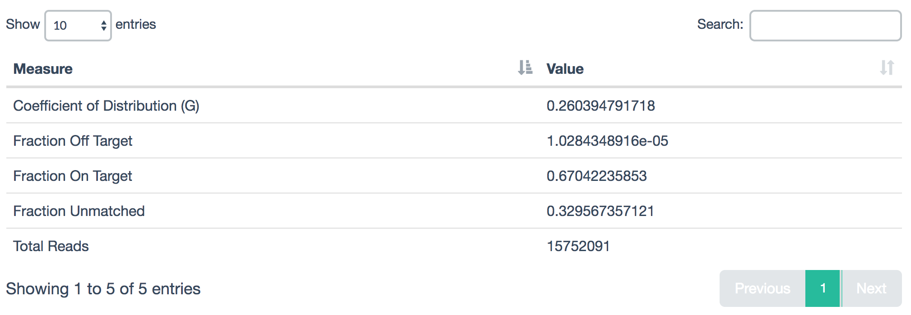

Table
=====

Example Data
````````````

.. csv-table::
    :file: ../_static/table_example.csv
    :header-rows: 1


Usage to Add
````````````

::

    $ fqc add --prepend \
          plot_data/2016/160912_M03018/config.json \
          'Run Stats' \
          table \
          data/tables/160912_summary.csv


Plot Options
````````````

+------------------+------------------------------------------------------------------------------------------------------------------+
| Option           | Value                                                                                                            |
+==================+==================================================================================================================+
| filename         | supports either a single file path or list of lists with [plot tab name, file path] pairs (see :ref:`plot-tabs`) |
+------------------+------------------------------------------------------------------------------------------------------------------+
| tab_name         | left main menu entry                                                                                             |
+------------------+------------------------------------------------------------------------------------------------------------------+
| status           | left main menu icon -- supports 'pass', 'fail', 'warn', or alternatively, omitted (see :ref:`tab-status`)        |
+------------------+------------------------------------------------------------------------------------------------------------------+

Example JSON entry::

    {
        "filename": "160912_summary.csv",
        "chart_properties": {
            "type": "table"
        },
        "tab_name": "Run Stats"
    }


